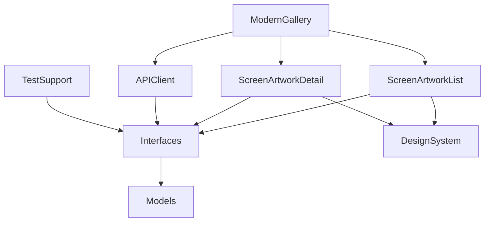

# Art Gallery

Art Institute of Chicago の公開APIを使った美術品カタログアプリ。
**SwiftPM によるマルチモジュール構成を実際に手を動かして確かめる**ために作った学習用のサンプルです。

## これは何か

普段の業務では単一モジュールのアプリを扱うことが多く、
モジュール分割を「設計として知っている」状態から「自分で組める」状態にしたくて作りました。

主題は次の2つです。

- **画面モジュールが通信の実装を知らない構成**を、protocol層を挟んで実際に組む
- Swift 6 の strict concurrency と SwiftUI で、最初から破綻しない形を試す

機能の多さではなく、**なぜその設計にしたか・何を採用しなかったか**を説明できることを目標にしています。
後半の「意図的に採用しなかったもの」「ハマったところ」がこのリポジトリの本体です。

題材に美術品カタログを選んだのは、認証不要のAPIで cloneすればすぐ動かせることと、
画像グリッド主体で状態網羅やアクセシビリティの検討が自然に必要になるためです。

## 制作におけるAIの利用

このリポジトリのコードは、Claude との対話を通じて書いています。

当初は「設計相談だけをAIに任せ、実装は自分で書く」進め方を想定していましたが、
実際には、提示された実装案をレビューして採用する形が大半になりました。
私が担ったのは、**何を作らないかの線引きと、複数の設計案からの選択、そして採用したコードの理解と検証**です。

進め方は Issue ごとに次の形を取りました。

1. 論点を洗い出す（例：グリッドの列設計、画像読み込みの方式、状態管理の置き場所）
2. 各論点について選択肢とトレードオフ、推奨案を提示してもらい、採否を自分で決める
3. 合意した方針でコミット単位の実装を出してもらい、レビューして取り込む
4. ビルド・テスト・プレビューでの確認は自分で行う

このREADMEに書いた設計判断は、いずれも選択肢と理由を検討した上で自分が決めたものです。
一方で、コードの多くを自分でタイプしたわけではありません。
成果物の見え方と実態が食い違わないよう、明記しておきます。

## 技術スタック

Swift 6（言語モード v6 / strict concurrency）/ SwiftUI / iOS 26.0 以上
SwiftPM ローカルパッケージ / XcodeGen / Swift Testing

外部ライブラリへの依存はありません。

## アーキテクチャ

### モジュール構成

```
LocalPackages/GalleryPackage/Sources/
├── Models/              # 純粋な型のみ。Foundation 以外に依存しない
├── Interfaces/          # protocol のみ。モジュール間の結節点
├── DesignSystem/        # 色・タイポグラフィ・ドメイン非依存のView
├── APIClient/           # Interfaces の実装
├── TestSupport/         # Interfaces のスタブとプレビュー用データ
├── ScreenArtworkList/   # 作品一覧
└── ScreenArtworkDetail/ # 作品詳細

Sources/ModernGallery/   # アプリターゲット（合成ルート）
```



**この構成で守りたかったのは2点です。**

1. **画面モジュールは `APIClient` に依存しない。** 画面は `Interfaces` の protocol だけを知り、
   実体は合成ルートが注入する。通信の実装を差し替えても画面は再コンパイルされない
2. **一覧と詳細も互いを import しない。** 両方を知っているのは合成ルートだけ

### 画面遷移とDI

依存はすべてイニシャライザで受け取ります。Environment もDIコンテナも使っていません。
各画面モジュールが公開しているのは `init` ひとつだけで、ViewModel もセルも internal に閉じています。

```swift
ArtworkListScreen(
    repository: any ArtworkRepository,
    query: ArtworkQuery,
    detailScreenBuilder: any ArtworkDetailScreenBuilding
)
```

遷移は `Interfaces` の protocol を経由します。

```swift
@MainActor
public protocol ArtworkDetailScreenBuilding: Sendable {
    func build(artworkID: Artwork.ID) -> AnyView
}
```

`AnyView` で型消去しているのは、`some View` を protocol requirement にすると associatedtype が生まれ、
`any ArtworkDetailScreenBuilding` として保持できなくなるためです。
モジュール境界で具体型を露出させないことを優先しました。

詳細画面へは `Artwork` ではなく ID だけを渡します。
一覧から値を丸ごと渡せば通信なしで表示できますが、
IDさえあれば画面が成立する形（ディープリンクや状態復元に開いた形）を選びました。

### テナントによる差し替え

ブランドカラーや取得条件をアプリターゲット側で差し替えられる構成にしてあります。

- `GalleryColor.brandPrimary` は **アプリのAsset → PackageのAsset → ハードコード** の順に解決する
- 部門フィルタなどテナント固有の値は `TenantConfiguration` として合成ルートで注入し、
  `ArtworkQuery` に翻訳する。`APIClient` も画面もテナントという概念を知らない

**2つ目のアプリターゲットはまだ作っていません。** 仕組みは用意しましたが、並べて検証してはいない状態です。

## テスト戦略

Swift Testing によるユニットテストが27件あります。

| ターゲット | 件数 | 対象 |
|---|---|---|
| APIClientTests | 12 | リクエスト組み立て、DTO→ドメイン変換、IIIF URL生成 |
| DesignSystemTests | 3 | 色の3段フォールバック |
| TestSupportTests | 3 | スタブ自身の振る舞い |
| ScreenArtworkList / DetailTests | 9 | ViewModelの状態遷移 |

方針は2つです。

**通信の周辺を純粋関数に切り出す。** リクエスト組み立てとDTO変換は、
入力から出力が一意に決まる関数だけの名前空間にしてあり、通信を経由せずに検証できます。

**ViewModelを公開せずに検証する。** internal のままにして `@testable import` で触ります。
状態を `enum State` ひとつにまとめてあるので、`#expect(viewModel.state == .failed(.offline))` と書けます。

書いていないもの: 通信の結合テスト（差し替え口は用意したが未着手）、スナップショットテスト、UIテスト。

## アクセシビリティ / HIGへの配慮

**やったこと**

- 独自のポイントサイズを定義せず、システムのテキストスタイルのみ使用
- グリッドの列の最小幅を `@ScaledMetric` に通し、文字拡大で列数が減るようにした（サイズクラス分岐なし）
- 一覧のセルを1要素にまとめ、「作品名、作家名、画像の説明」の順に読み上げ。
  説明には美術館提供の `alt_text` を使い、説明の無い画像は読み上げ対象から外す
- 空・エラー状態は `ContentUnavailableView` に委譲
- 404 は再試行しても回復しないため、リトライ導線を出さない

**やっていないこと**

AX4/AX5 での全画面検証、コントラスト比の実測、Reduce Motion 対応、読み上げ順序の詳細な調整。

## 意図的に採用しなかったもの

| | 判断 | 理由 |
|---|---|---|
| DIフレームワーク | 不採用 | 2画面規模ではコード生成の運用コストが利得を上回る。イニシャライザ注入でも依存の明示性は確保できる |
| 独自のRouter層 | 不採用 | protocolで疎結合にする発想は採用し、遷移は `NavigationStack` と `navigationDestination` で代替した |
| GraphQL | 不採用 | 学習途上のため、浅い実装を成果として出すことを避けた。RESTのオーバーフェッチという課題との対応は理解している |
| SwiftData | 不採用 | 期間内の優先順位として、モジュール分割とテストを優先した |
| 画像キャッシュライブラリ | 不採用 | 外部依存はモジュール分割の見通しを薄める。代わりに IIIF のサーバ側リサイズと `URLCache` の容量拡張で負荷を下げた |
| ページネーション | 見送り | 1ページ分の表示と状態網羅を優先。`ArtworkPage` が次ページ番号を保持しており、追加時の変更はViewModel内に閉じる |
| CI | 見送り | 時間配分の結果。`make test` で同じ検証がローカルで回る |
| スナップショットテスト | 見送り | 2テナント間の差分検証とセットで意味を持つ。テナントが1つの現状では効果が薄い |

## ハマったところ

### Package内から `Bundle.main` のAssetは見えない

`Color("BrandPrimary")` は `Bundle.module` を見に行くため、アプリターゲットのAssetが参照されません。
バンドルを明示し、アプリ → Package → ハードコードの3段で解決するようにしました。

さらにこれを `static let` にすると、テストやプレビューのように `Bundle.main` がアプリのAssetを持たない文脈で
最初に触れた結果がプロセスの寿命の間ずっと固定されます。computed property にして毎回解決させています。

### `URLCache.shared` の差し替えはRepository生成より前に

`AsyncImage` は `URLSession.shared` 経由で取得し、`URLSession.shared` は初回アクセス時に
`URLCache.shared` を取り込みます。Repository を先に作ると、あとからキャッシュを差し替えても効きません。

### `defaultIsolation` を全モジュールに効かせてはいけない

`.defaultIsolation(MainActor.self)` をパッケージ全体に付けると、`Interfaces` の protocol requirement が
暗黙に `@MainActor` になり、通信処理やユニットテストまでメインスレッドに隔離されます。
UI層とドメイン層で `Package.swift` の設定を分けました。

### 件数でページ終端を判定できない

画像を持たない作品はドメインモデルに変換できないため、マッピング段階で除外しています。
結果として1ページの件数が要求した `limit` を下回るので、
「件数が `limit` 未満なら最終ページ」という判定は使えません。`current_page` と `total_pages` だけを根拠にしています。

（他に、部門での絞り込みが `department_title.keyword` でないと多語の値に一致しないこと、
`config.iiif_url` がテスト環境のホストを返すことがあり正規化が要ることにも当たりました）

## 今後やるとしたら

2つ目のアプリターゲット → ページネーション → CI → スナップショットテスト → 文言のローカライズ差し替え →
`AsyncImage` の置き換え（デコード済みキャッシュがなく、長いスクロールの往復で再デコードが走る）。

## 動かし方

必要なもの: Xcode 26.6 以降、Homebrew

```bash
git clone https://github.com/mcr927/art-gallery.git
cd art-gallery

make bootstrap   # xcodegen を入れる
make open        # プロジェクトを生成して開く
make test        # 27件
```

`ModernGallery` スキームを選んで実行してください。APIキーの設定は不要です。

作品データと画像は [Art Institute of Chicago API](https://api.artic.edu/docs/) から取得しています。